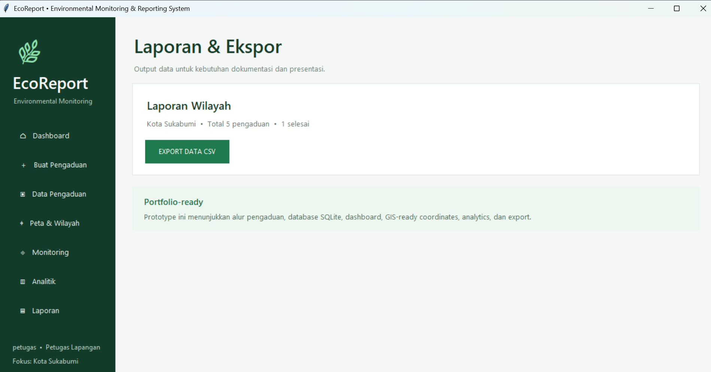
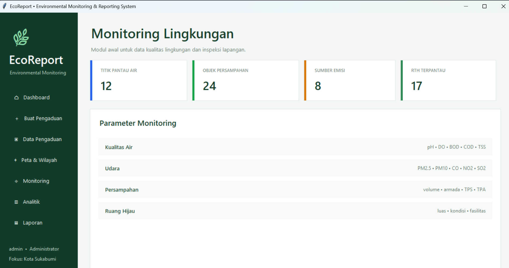
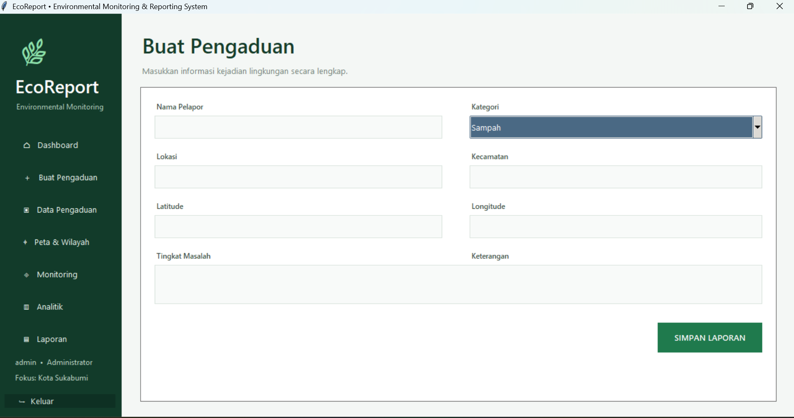
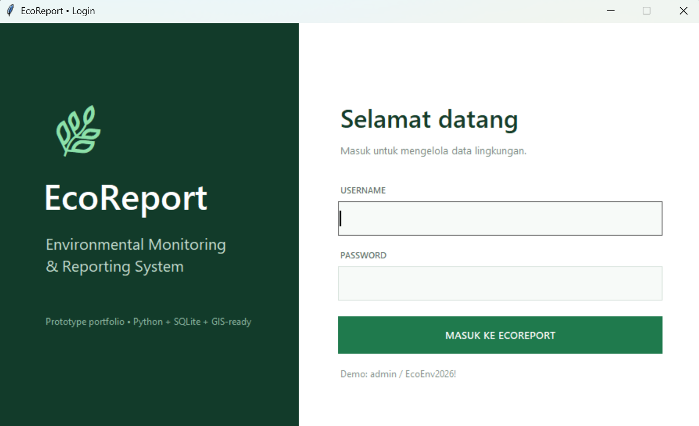
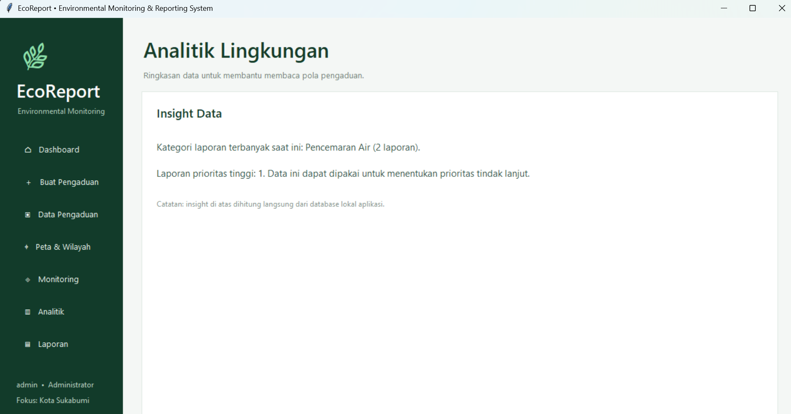
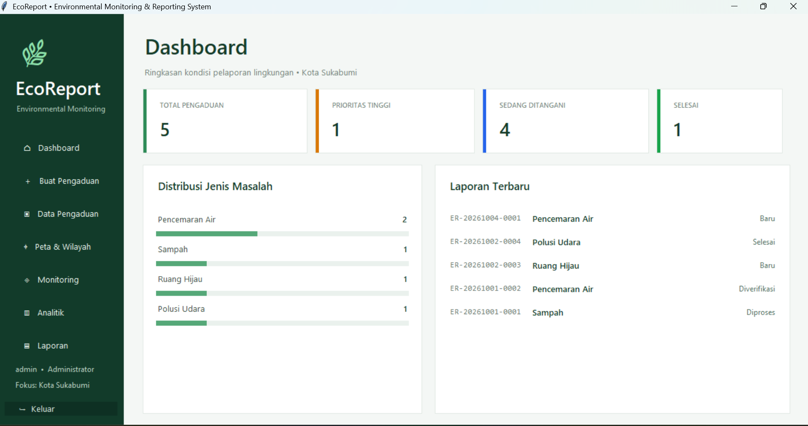
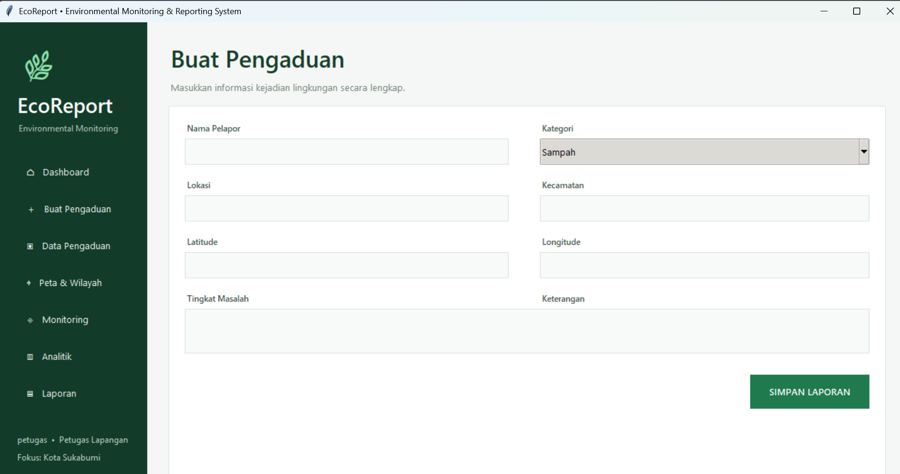
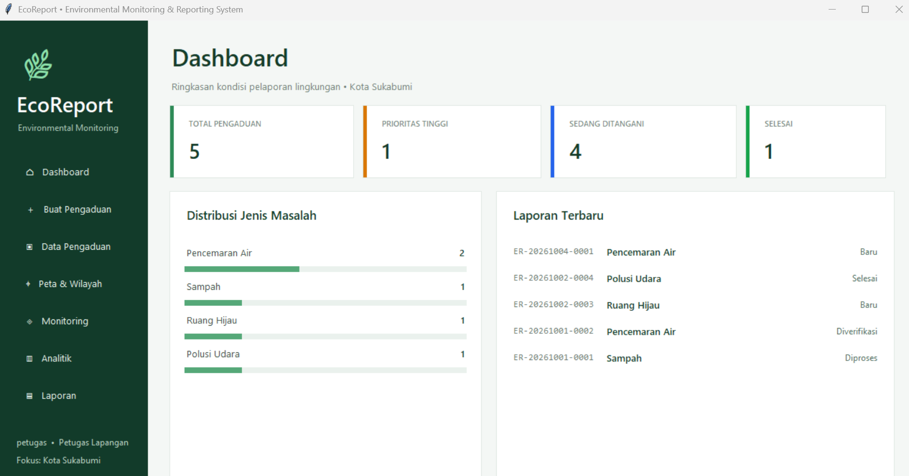
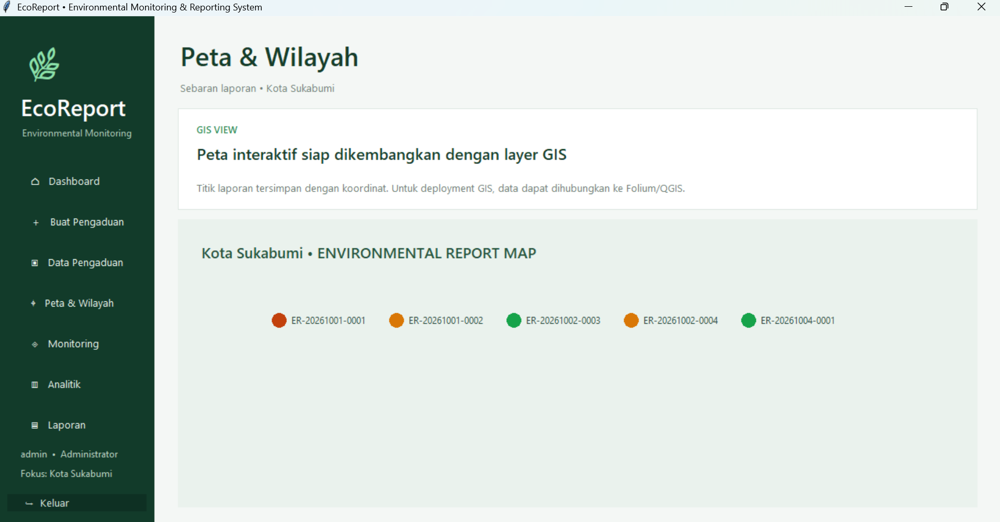
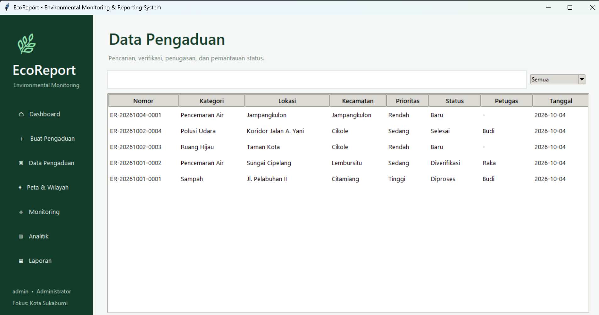

# EcoReport
### Environmental Monitoring & Reporting System

EcoReport adalah aplikasi desktop untuk membantu pencatatan, pengelolaan, pemantauan, dan pelaporan masalah lingkungan di Kota Sukabumi.

## Fitur Utama

- Dashboard kondisi pengaduan lingkungan
- Sistem login dengan role Administrator dan Petugas Lapangan
- Pembuatan laporan/pengaduan lingkungan
- Pengelolaan data pengaduan
- Kategori masalah lingkungan:
  - Sampah
  - Pencemaran Air
  - Polusi Udara
  - Ruang Hijau
- Penentuan tingkat prioritas masalah
- Peta & wilayah berbasis koordinat
- Monitoring lingkungan
- Analitik data pengaduan
- Export data ke CSV
- Database lokal menggunakan SQLite

## Teknologi

- Python
- Tkinter
- SQLite
- CSV
- GIS-ready coordinates

  ## Screenshot Aplikasi

### Dashboard Admin


### Buat Pengaduan Admin


### Data Pengaduan Admin


### Peta Wilayah Admin


### Monitoring Admin


### Analitik Admin


### Dashboard Petugas


### Buat Pengaduan Petugas


### Data Pengaduan Petugas


### Laporan Ekspor Admin


## Cara Menjalankan

### 1. Clone Repository

```bash
git clone https://github.com/zakimaul2505-cmyk/EcoReport.git
cd EcoReport
```

### 2. Jalankan Program

Pastikan Python sudah terinstall di komputer.

```bash
python ecoreport.py
```

> Jika nama file program utama berbeda, gunakan nama file `.py` utama yang terdapat di repository.

### 3. Login

Masuk menggunakan akun yang tersedia pada sistem sebagai:

* **Administrator**
* **Petugas Lapangan**

### 4. Alur Penggunaan

1. Login ke sistem
2. Pilih menu sesuai role pengguna
3. Buat atau lihat pengaduan lingkungan
4. Pantau kondisi lingkungan
5. Lihat peta dan analitik data
6. Export laporan jika diperlukan

## Role Pengguna

### Administrator

Administrator dapat melihat dashboard, mengelola data pengaduan, melihat peta wilayah, monitoring, analitik, dan melakukan export laporan.

### Petugas Lapangan

Petugas Lapangan dapat membuat dan memantau pengaduan lingkungan di lapangan.

## Fokus Wilayah

Kota Sukabumi

## Status Project

Prototype / Portfolio Project

Project ini dikembangkan sebagai portfolio di bidang Teknik Lingkungan dengan menggabungkan pemrograman dasar, pengelolaan data, monitoring lingkungan, dan konsep GIS.
